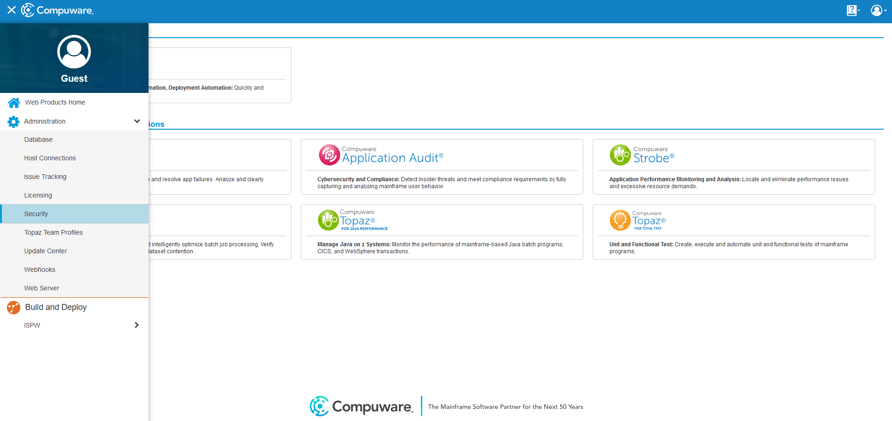
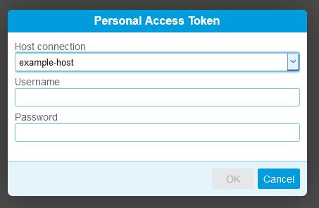
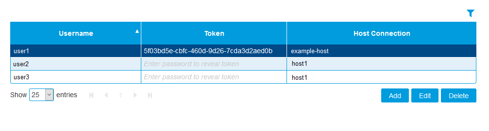
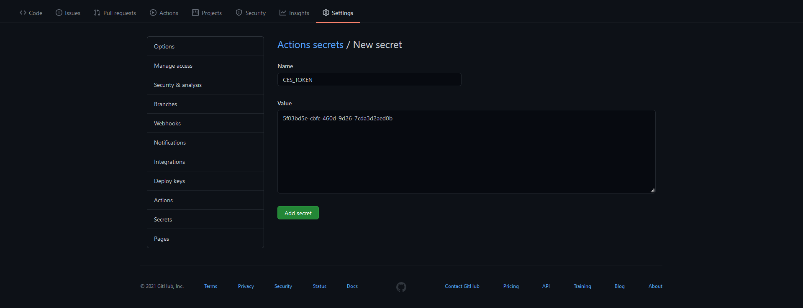

# Code Pipeline Generate

The Code Pipeline Generate action allows your GitHub Actions workflow to trigger a generate in your instance of BMC AMI DevX Code Pipeline(Code Pipeline) on the mainframe. This action can be used in scenarios where your mainframe source is stored in git, or when you want your GitHub Actions workflow to operate on source that is already stored in Code Pipeline.

## Templates
Create a GitHub workflow file, for example, [ispw-sync-build-deploy.yml](.github/templates/ispw-sync-build-deploy.yml) the workflow is broken up into the following stages:
- Checkout - checks out the source code.
- Synchronize changeset to Code Pipeline - uses GitHub action Code Pipeline Sync to perform GitHub to Code Pipeline synchronization.
- Build Code Pipeline tasks - uses GitHub action Code Pipeline Build to perform a build
- Deploy Code Pipeline tasks - uses gitHub action Code Pipeline Deploy to perform a deploy

Or if you prefer to use GitHub action Code Pipeline Sync Local, you may specify the sync step. 
For example, [ispw-sync-local-generate-deploy.yml](.github/templates/ispw-sync-local-generate-deploy.yml) the workflow is broken up into the following stages :
- Checkout - checks out the source code.
- Synchronize changeset to Code Pipeline - uses GitHub action Code Pipeline Sync Local to perform GitHub to Code Pipeline synchronization.
- Generate Code Pipeline tasks - uses GitHub action Code Pipeline Generate to perform a generate
- Deploy Code Pipeline tasks - uses gitHub action Code Pipeline Deploy to perform a deploy

## Example usage

The following example will automatically retrieve the generate parameters from a previous step in the job

``` yaml
on: [push]

jobs:
  run-ispw-generate:
    runs-on: ubuntu-latest
    name: A job to sync git source into Code Pipeline, then generate it on the mainframe
    steps:
      - name: Sync step
        uses: bmc-compuware/ispw-sync@v20.6.1.gtk
        id: sync
        with:
          host: 'host.example.com'
          port: 37733
          uid: ${{ secrets.TSOUSER }}
          pass: ${{ secrets.TSOPASS }}
          runtimeConfiguration: 'ISPW'
          stream: 'PLAY'
          application: 'PLAY'
          checkoutLevel: 'DEV2'
          gitUid: 'admin'
          gitToken: ${{ secrets.GITHUB_TOKEN }}
          showEnv: true
      - name: Generate
        uses: bmc-compuware/ispw-generate@v1
        id: generate
        with:
          ces_url: 'https://CES:48226/'
          ces_token: ${{ secrets.CES_TOKEN }}
          srid: 'host-37733'
          runtime_configuration: 'ISPW'
          generate_automatically: ${{ steps.sync.outputs.automaticBuildJson }}
      - name: Get the number of generate failures
        run: echo "The number of generate failures is ${{ steps.generate.outputs.generate_failed_count }}"
```

The following example will generate two specific Code Pipeline tasks within assignment PLAY000826

``` yaml
on: [push]

jobs:
  run-ispw-generate:
    runs-on: ubuntu-latest
    name: A job to generate source in Code Pipeline
    steps:
      - name: Generate
        uses: bmc-compuware/ispw-generate@v1
        id: generate
        with:
          ces_url: "https://CES:48226/"
          ces_token: ${{ secrets.CES_TOKEN }}
          srid: host-37733
          runtime_configuration: ISPW
          assignment_id: PLAY000826
          level: DEV1
          task_id: "7E3A5B274D24,7E3A5B274EFA"
      - name: Get the set ID for the generate
        run: echo "The Code Pipeline set used for the generate is ${{ steps.generate.outputs.set_id }}"
```

## Inputs

| Input name | Required | Description |
| ---------- | -------- | ----------- |
| `ces_url` | Required | The URL to use when connecting to CES |
| `ces_token` | Required | The token to use when authenticating the request to CES |
| `srid` | Required | The SRID of the Code Pipeline instance to connect to |
| `change_type` | Required | The change type of this request. The default value is 'S' for standard. |
| `execution_status` | Required | The flag to indicate whether the generate should happen immediately, or should be held. The default is 'I' for immediate. Other possible value is 'H' for hold. |
| `auto_deploy` | Required | Generates can be set up to automatically Deploy as well by an option set up by the Code Pipeline. The default is to not use Auto Deploy. If the Auto Deploy option is set-up through Code Pipeline, then you may use this option to automatically deploy. Possible values are `true` or `false`. |
| `runtime_configuration` | Optional | The runtime configuration for the instance of Code Pipeline you are connecting to. |
| `generate_automatically` | Optional | A string of JSON that contains the parameters for the generate. If using an code-pipeline-sync step before the generate, this JSON string can be retrieved from the outputs of that step. If `generate_automatically` is not being used, then the `assignment_id`, `level`, and `task_id` must be specified. |
| `assignment_id` | Optional | The assignment for which you intend to generate tasks. Do not use if `generate_automatically` has already been specified. |
| `level` | Optional | The level that the tasks exist at in the assignment. Do not use if `generate_automatically` has already been specified. |
| `task_id` | Optional | The comma-separated string of task IDs for the tasks that need to be generated. Do not use if `generate_automatically` has already been specified. |

## Outputs

| Output name | Output type | Description |
| ----------- | ----------- | ----------- |
| `generate_failed_count` | number | The number of tasks that failed to generate. |
| `generate_success_count` | number | The number of tasks that generated successfully. |
| `is_timed_out` | boolean | Whether the generate timed out. A time out would indicate that the generate has not completed and may still be running. |
| `has_failures` | boolean | Whether there were any generate failures. |
| `task_count` | number | The total number of tasks a generate was initiated against. |
| `set_id` | string | The ID of the set that was used for processing. |
| `url` | string | The URL that can be used to retrieved information about the set that was used for processing. |
| `output_json` | JSON | the JSON output from build |

## Setup

### Create a token in Common Enterprise Services (CES)

In order to use this action, you must have an instance of the CES product installed on one of your runners. Once that is complete, you will need to open CES in your web browser and create a token to be used during requests. To set up a new host connection, go to the hamburger menu in the upper left corner and select Host Connections.



On the Host Connection Settings page, click "Add." Set up the host connection to be used for Code Pipeline and click OK when finished.

Then, go back to the menu and select Security. On the Security page, click Add and the Personal Access Token dialog will come up.



On the Personal Access Token dialog, select the host that you want to create a token for, and enter in the mainframe username and password.

Once done, there will be a new token in the table on the Security page



### Save the token as a GitHub Secret

From the Security page in CES, copy the token. In GitHub go to Settings > Secrets and click the button for New Repository Secret.


On the New Secret page, paste the token that was copied earlier and click the Add secret button. Make a note of the name you give the secret so that you can easily use it in your workflow script.



### Fill in the workflow script

Use the examples above to fill in a workflow script using the Code Pipeline Generate action. Note that if you want the input assignment, level, and taskIds to be automatically picked up from the Code Pipeline synchronization with Git, you will need a synchronization step in you job, which will run before the generate.

### Troubleshooting

To enable debug logging in your GitHub actions workflow, see the guide [here](https://docs.github.com/en/actions/managing-workflow-runs/enabling-debug-logging).

### Developers

For information about contributing to the Code Pipeline Generate action, see [Developing on the Code Pipeline Generate GitHub action](./CONTRIBUTING.md)

## See also
- [License](LICENSE.txt)
